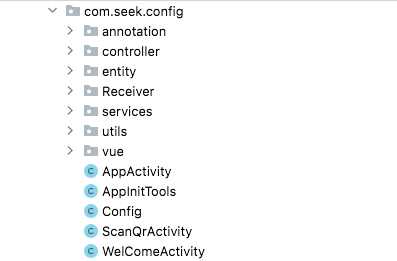

## 文件目录说明

apk 目录是android studio 程序文件目录，
其中 `pc-vue-page`和 `vue-page`是vue项目，分别作用是`pc-vue-page`是pc端页面程序，`vue-page`是android Studio程序里所需要的页面文件(目前使用的是远程地址方式，需要在`./app/src/main/assets/client.html`中进行修改请求地址路径)

### /app/standard-beacon-config-tool-app/app/src/main

#### assets

存放前端文件

#### java

代码文件

